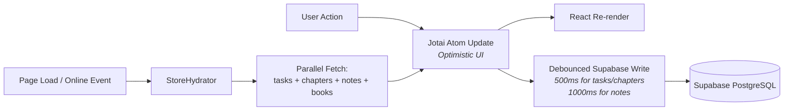

<p align="center">
  
  
  
  
  
  
</p>

<h1 align="center">
  📅 Day Planner
</h1>

<p align="center">
  <strong>A premium, neon-infused study planner</strong> with a weekly timetable grid, interactive dashboard analytics, subject & chapter tracking, a book library, backlog management, a floating timer/stopwatch, quick notes, and print-ready schedules — all powered by Supabase cloud sync.
</p>

<p align="center">
  <a href="#-features">Features</a> •
  <a href="#-tech-stack">Tech Stack</a> •
  <a href="#-architecture">Architecture</a> •
  <a href="#%EF%B8%8F-getting-started">Getting Started</a> •
  <a href="#-database-schema">Database</a> •
  <a href="#-ui-design-system">Design System</a> •
  <a href="#-project-structure">Project Structure</a>
</p>

---

## ✨ Features

### 🗓️ Weekly Planner (Home Page)
The heart of the app — a Google Calendar-style **time-grid** spanning 6 AM → Midnight (18 hours) across 7 days.

| Feature | Description |
|---|---|
| **Absolute-positioned task blocks** | Tasks span multiple time slots based on their start/end times, rendered as absolutely-positioned overlays on the grid |
| **Subject color coding** | Each subject (Physics ⚛️, Chemistry 🧪, Maths 📐, Biology 🧬, English 📝) has its own unique gradient + glow color |
| **Priority ribbon flags** | Top-right corner triangle badges with H/M/L initials |
| **Inline status/priority panel** | Expand a task's bottom tab to quickly set ✅ Completed / ⏭️ Skipped status and 🟠🟡🟢 priority levels |
| **Today column glow** | Dual animated saber beams (cyan clockwise + magenta counter-clockwise) wrap the today column using `conic-gradient` animations |
| **Current time indicator** | A red horizontal line showing real-time position, updated every 60s |
| **Week navigation** | Prev/Next arrows + "NOW" button to jump to the current ISO week |
| **Click-to-create** | Click any empty time slot to open the task creation modal pre-filled with that date and time |

### 📊 Dashboard
A comprehensive analytics view with **6 stat cards** and **6 data visualizations**, all with animated loading skeletons.

| Widget | Type | Data |
|---|---|---|
| **Today Progress** | Stat card + SVG ring | Tasks done/total with animated progress circle |
| **Hours This Week** | Stat card | Sum of completed task durations |
| **Total / Completed / Completion Rate** | Stat cards | All-time metrics |
| **Overdue Count** | Stat card | Dynamic red/green color based on count |
| **Daily Study Hours** | Recharts `BarChart` | Last 14 days of study hours |
| **Weekly Progress** | SVG donut chart | Animated progress ring with Framer Motion |
| **Hours by Subject** | Recharts `BarChart` | Subject-colored bars for the current week |
| **Weekly Trend** | Recharts `LineChart` | 4-week trend with neon cyan glow |
| **Category Breakdown** | Recharts `PieChart` | Donut chart of task categories |
| **Upcoming Tasks** | List | Next 8 pending tasks with urgency fading |
| **Subject Progress** | Progress bars | Per-subject completion with animated fills |
| **Chapter Progress** | Grid cards | Per-subject chapter status breakdown |

### 📕 Library
A beautiful, interactive **bookshelf UI** for managing study books per subject.

| Feature | Description |
|---|---|
| **Visual bookshelf** | Books displayed as physical spines on wooden shelves with 3D depth illusion, shadows, and wood-grain textures |
| **Subject-colored spines** | Each subject has a unique spine color palette with deterministic height/width variations for visual interest |
| **Hover tooltip cards** | Hovering a book spine reveals a floating card with title, author, publisher, subject badge, and edit/delete actions |
| **Subject tab filtering** | Tab bar to filter by subject or view the complete "All Books" collection |
| **CRUD modal** | Add/edit books with title, author, publisher fields; subject selector for new books |
| **Task linking** | Books from the library can be linked to tasks in the task modal (for Theory, Revision, Practice, and Others categories) |

### 📚 Subjects & Chapters
A **2×2 quadrant grid** (Physics, Chemistry, Maths, Biology) + a full-width English card.

- **Chapter management** — Add, delete, and track chapters per subject
- **3-state status selector** — ⏸️ Not Started → 📖 In Progress → ✅ Completed — with an animated dropdown
- **Progress bars** — Per-subject completion percentage with gradient fills and glow shadows
- **Visual hierarchy** — Chapters are rendered with fading opacity based on their position

### ⚠️ Backlogs
A dedicated view for managing overdue tasks with **bulk actions**.

| Feature | Description |
|---|---|
| **Urgency badges** | Color-coded: Yellow (< 3 days), Orange (3–7 days), Red (> 7 days overdue) |
| **Bulk selection** | Select all / individual checkboxes |
| **Bulk actions** | ✅ Mark Done, 📅 Reschedule to Today/Tomorrow, ⏭️ Skip, 🗑️ Delete |
| **Empty state** | Celebratory "All caught up!" screen with emerald glow |

### ⏱️ Timer & Stopwatch
A **floating, draggable widget** with dual modes.

| Feature | Description |
|---|---|
| **Timer mode** | Countdown with presets: 15, 25, 50 min + Custom |
| **Stopwatch mode** | Count-up with lap tracking |
| **Task linking** | Attach a timer to a specific task — elapsed time auto-syncs to `time_spent` |
| **Circular progress** | SVG ring with animated fill and Orbitron font |
| **Completion sound** | Web Audio API synthesized 4-note ascending chime (C5→C6) |
| **Minimizable** | Collapse to a compact 56px bar |
| **Persistent state** | Timer position, mode, and preset survive page refreshes via `atomWithStorage` |
| **High-precision loop** | Uses `requestAnimationFrame` instead of `setInterval` for accurate timing |

### 📝 Quick Notes
A **slide-in panel** accessible from any page via the topbar.

- **Inline editing** — Click a note to edit in place
- **Toggle completion** — Checkbox to mark notes as done
- **Badge count** — Topbar shows undone count with a rose notification pill
- **Debounced sync** — Edits push to Supabase after 1s of inactivity

### 🖨️ Print Modal
Generate print-ready daily routines.

- Opens a new browser window with a clean, styled schedule
- Includes subject colors, chapter names, priority dots, and status icons
- Auto-closes the print window after the user finishes the print dialog

---

## 🛠 Tech Stack

| Layer | Technology | Purpose |
|---|---|---|
| **Framework** | [Next.js 16](https://nextjs.org/) (App Router) | Server/client rendering, file-based routing |
| **UI Library** | [React 19](https://react.dev/) | Component model, hooks |
| **State Management** | [Jotai 2](https://jotai.org/) | Atomic state with `atom`, `atomWithStorage` |
| **Database** | [Supabase](https://supabase.com/) (PostgreSQL) | Cloud-first data persistence with RLS |
| **Styling** | [Tailwind CSS 4](https://tailwindcss.com/) + Vanilla CSS (~1800 lines) | Utility classes + custom neon design system |
| **Animations** | [Framer Motion 12](https://www.framer.com/motion/) | Page transitions, progress bars, staggered lists |
| **Charts** | [Recharts 3](https://recharts.org/) | Bar, Line, Pie charts with custom tooltips |
| **UI Primitives** | [Radix UI](https://www.radix-ui.com/) + [shadcn/ui](https://ui.shadcn.com/) | Dialog, Select, Dropdown, Tooltip, Checkbox, etc. |
| **Icons** | [Lucide React](https://lucide.dev/) | 40+ clean, consistent SVG icons |
| **Dates** | [Day.js](https://day.js.org/) | Lightweight date manipulation with ISO week support |
| **Fonts** | Inter (UI), JetBrains Mono (monospace), Orbitron (display) | Typography hierarchy |
| **Notifications** | [Sonner](https://sonner.emilkowal.dev/) | Toast notifications with rich styling |
| **Audio** | Web Audio API | Synthesized timer completion sounds |

---

## 🏗 Architecture

### System Overview

```
┌──────────────────────────────────────────────────────────────┐
│                        Next.js App Router                    │
│  ┌────────────────────────────────────────────────────────┐  │
│  │                    RootLayout                          │  │
│  │  ┌──────────────────────────────────────────────────┐  │  │
│  │  │              Jotai <Provider>                    │  │  │
│  │  │  ┌──────────────┐  ┌──────────────────────────┐  │  │  │
│  │  │  │StoreHydrator │  │ ErrorBoundary → AppShell │  │  │  │
│  │  │  │ (Supabase    │  │ ┌────────┐ ┌──────────┐ │  │  │  │
│  │  │  │  fetch on    │  │ │Sidebar │ │  Topbar  │ │  │  │  │
│  │  │  │  mount +     │  │ ├────────┤ ├──────────┤ │  │  │  │
│  │  │  │  online)     │  │ │ Routes │ │ <main/>  │ │  │  │  │
│  │  │  └──────────────┘  │ └────────┘ ├──────────┤ │  │  │  │
│  │  │                     │           │StatusBar │ │  │  │  │
│  │  │  ┌──────────┐       │           └──────────┘ │  │  │  │
│  │  │  │QuickNotes│       │ ┌────────────────────┐ │  │  │  │
│  │  │  │(overlay) │       │ │   TimerWidget      │ │  │  │  │
│  │  │  └──────────┘       │ │   (floating)       │ │  │  │  │
│  │  │                     │ └────────────────────┘ │  │  │  │
│  │  │                     └──────────────────────────┘  │  │
│  │  └──────────────────────────────────────────────────┘  │  │
│  └────────────────────────────────────────────────────────┘  │
│                              ▼                               │
│                     Supabase PostgreSQL                       │
│              (tasks, chapters, notes, books)                  │
└──────────────────────────────────────────────────────────────┘
```

### Data Flow



### State Management (Jotai)

| Atom | Type | Persistence | Purpose |
|---|---|---|---|
| `tasksAtom` | `atom([])` | Cloud-only | All tasks (fetched from Supabase) |
| `chaptersAtom` | `atom([])` | Cloud-only | All chapters |
| `notesAtom` | `atom([])` | Cloud-only | Quick notes |
| `booksAtom` | `atom([])` | Cloud-only | Library books |
| `hydrationStatusAtom` | `atom('idle')` | Memory | Loading state: idle → loading → done/error |
| `sidebarCollapsedAtom` | `atomWithStorage` | localStorage | Sidebar expanded/collapsed |
| `notesPanelOpenAtom` | `atom(false)` | Memory | Quick notes panel visibility |
| `currentWeekStartAtom` | `atom(...)` | Memory | Currently viewed week (ISO Monday) |
| `timerOpenAtom` | `atomWithStorage` | localStorage | Timer widget visibility |
| `timerSecondsAtom` | `atomWithStorage` | localStorage | Current timer value |
| `timerRunningAtom` | `atom(false)` | Memory | Running state (never persisted to prevent stale auto-resume) |
| `timerLinkedTaskAtom` | `atomWithStorage` | localStorage | Task linked to the timer |

### Custom Hooks

| Hook | File | Description |
|---|---|---|
| `useTaskActions()` | `lib/atoms.js` | CRUD operations for tasks with debounced cloud sync |
| `useChapterActions()` | `lib/atoms.js` | CRUD for chapters |
| `useNoteActions()` | `lib/atoms.js` | CRUD for notes (add, toggle, delete, edit) |
| `useBookActions()` | `lib/atoms.js` | CRUD for library books |
| `useWeekNavigation()` | `lib/atoms.js` | Navigate between ISO weeks |
| `useTimerActions()` | `lib/timer-atoms.js` | Timer widget controls (open, close, preset, link) |
| `useTimer()` | `hooks/use-timer.js` | High-precision timing loop using `requestAnimationFrame` |

---

## ⚙️ Getting Started

### Prerequisites

- **Node.js** ≥ 18
- **npm** ≥ 9
- A **Supabase** project (free tier works)

### 1. Clone & Install

```bash
git clone https://github.com/dso904/Study-Planner.git
cd Study-Planner
npm install
```

### 2. Configure Supabase

Create a `.env.local` file in the project root:

```env
NEXT_PUBLIC_SUPABASE_URL=https://your-project.supabase.co
NEXT_PUBLIC_SUPABASE_ANON_KEY=your-anon-key-here
NEXT_PUBLIC_SUPABASE_APP_SECRET=your-secret
```

### 3. Initialize the Database

Open your Supabase SQL Editor and run [`supabase-schema.sql`](supabase-schema.sql). This creates:
- ✅ Four tables: `tasks`, `chapters`, `notes`, `books`
- ✅ Row Level Security (RLS) policies using custom header authentication
- ✅ Indexes for date, subject, and done-status queries
- ✅ Auto-updating `updated_at` triggers on all tables

### 4. Run the Dev Server

```bash
npm run dev
```

Open [http://localhost:3000](http://localhost:3000) and you're live. 🎉

### 5. Build for Production

```bash
npm run build
npm start
```

---

## 🗄 Database Schema

### Tables

```sql
┌──────────────────── tasks ────────────────────┐
│ id            UUID PRIMARY KEY (auto)          │
│ title         TEXT NOT NULL                     │
│ subject_id    TEXT         (e.g. 'physics')     │
│ subject_name  TEXT         (e.g. 'Physics')     │
│ chapter_id    TEXT         (UUID ref)           │
│ category      TEXT         (lecture/theory/     │
│                            revision/practice/   │
│                            test/school/tuition/ │
│                            others)              │
│ priority      TEXT         (high/medium/low)    │
│ status        TEXT         (pending/done/skip)  │
│ date          DATE NOT NULL                     │
│ start_time    TEXT         ('09:00')            │
│ end_time      TEXT         ('10:00')            │
│ notes         TEXT                              │
│ is_backlog    BOOLEAN                           │
│ original_date DATE                              │
│ time_spent    INT          (seconds from timer) │
│ created_at    TIMESTAMPTZ                       │
│ updated_at    TIMESTAMPTZ  (auto-trigger)       │
│ book_id       TEXT         (UUID ref to books)  │
└────────────────────────────────────────────────┘

┌──────────── chapters ─────────────┐
│ id           UUID PRIMARY KEY     │
│ subject_id   TEXT NOT NULL        │
│ name         TEXT NOT NULL        │
│ status       TEXT (3 states)      │
│ sort_order   INT                  │
│ notes        TEXT                 │
│ created_at   TIMESTAMPTZ         │
│ updated_at   TIMESTAMPTZ         │
└───────────────────────────────────┘

┌──────────── notes ────────────────┐
│ id           UUID PRIMARY KEY     │
│ text         TEXT NOT NULL        │
│ done         BOOLEAN              │
│ created_at   TIMESTAMPTZ         │
│ updated_at   TIMESTAMPTZ         │
└───────────────────────────────────┘

┌──────────── books ────────────────┐
│ id           UUID PRIMARY KEY     │
│ subject_id   TEXT NOT NULL        │
│ title        TEXT NOT NULL        │
│ author       TEXT                 │
│ publisher    TEXT                 │
│ sort_order   INT                  │
│ created_at   TIMESTAMPTZ         │
│ updated_at   TIMESTAMPTZ         │
└───────────────────────────────────┘
```

### Security Model

The app uses **custom header-based Row Level Security**:

```
Client (Supabase JS) ──[x-app-secret: H6V$f%x@bN]──► Supabase
                                                        ▼
                                               RLS Policy Check:
                                               request.headers->>'x-app-secret'
                                               must match secret
```

> **Note:** The Supabase project URL is stored in `.env.local` (gitignored), so the database is inaccessible without both the URL and the secret.

### Indexes

| Index | Table | Column | Purpose |
|---|---|---|---|
| `idx_tasks_date` | tasks | `date` | Fast week/day queries |
| `idx_tasks_subject` | tasks | `subject_id` | Subject filtering |
| `idx_chapters_subject` | chapters | `subject_id` | Chapter lookups |
| `idx_notes_done` | notes | `done` | Quick undone count |
| `idx_books_subject` | books | `subject_id` | Book lookups by subject |

---

## 🎨 UI Design System

### Color Palette

The app uses a **neon-on-dark** aesthetic with these primary accent colors:

| Color | Hex | CSS Variable | Usage |
|---|---|---|---|
| 🟣 Violet | `#8b5cf6` | `--color-neon-violet` | Primary accent, sidebar active states |
| 🔵 Cyan | `#22d3ee` | `--color-neon-cyan` | Today highlights, in-progress states |
| 🩷 Pink | `#f472b6` | `--color-neon-pink` | Chemistry subject, category charts |
| 🟠 Orange | `#fb923c` | `--color-neon-orange` | Backlog urgency, upcoming tasks |
| 🟢 Green | `#34d399` | `--color-neon-green` | Completed states, Biology subject |
| 🔴 Red | `#f43f5e` | `--color-neon-red` | Destructive actions, critical priority |
| 🟡 Yellow | `#facc15` | `--color-neon-yellow` | Physics subject, medium priority |

### Subject Color Map

| Subject | Emoji | Color | Gradient |
|---|---|---|---|
| Physics | ⚛️ | `#facc15` | Golden amber |
| Chemistry | 🧪 | `#f472b6` | Pink rose |
| Maths | 📐 | `#ef4444` | Crimson red |
| Biology | 🧬 | `#34d399` | Emerald green |
| English | 📝 | `#60a5fa` | Sky blue |

### Typography

| Font | Variable | Usage |
|---|---|---|
| **Inter** | `--font-inter` | Body text, headings |
| **JetBrains Mono** | `--font-mono` | Monospace labels, badges, stats |
| **Orbitron** | (imported) | Time labels in the weekly grid, timer display |

### Visual Effects

| Effect | Implementation | Used In |
|---|---|---|
| **Glassmorphism** | `backdrop-filter: blur(20px)` + translucent backgrounds | Sidebar, topbar, status bar, panels |
| **Neon glow text** | Multi-color gradient with `background-clip: text` | Dashboard stats |
| **Animated mesh background** | 6 radial gradients + SVG noise texture + floating blobs with `meshDrift` keyframes | Body background |
| **Dual saber border** | `conic-gradient` with `@property --angle` animation (clockwise cyan + counter-clockwise magenta) | Today column |
| **Shimmer bars** | `linear-gradient` horizontal sweep animation | In-progress task blocks |
| **Progress pulse** | `box-shadow` keyframe animation | In-progress task glow |
| **Striped overlay** | `repeating-linear-gradient(-45deg, ...)` | Skipped task blocks |
| **Staggered entrance** | Framer Motion with delay multiplied by index | Dashboard cards, backlog list, subject chapters |
| **Custom scrollbar** | 6px width, transparent track, translucent thumb | Global |
| **Dot grid pattern** | 24×24px repeating radial gradient | Body overlay |

### Task Status Visual States

| Status | Border Color | Special Effect |
|---|---|---|
| `pending` | Subject color | Normal — subtle left border glow |
| `in_progress` | Cyan `#22d3ee` | Pulsing glow animation + animated shimmer bar at bottom |
| `done` | Green `#34d399` | Emerald glow + green tint overlay + strikethrough title |
| `skipped` | Slate `#64748b` | Diagonal stripes + blue-gray tint + strikethrough title |
| `missed` | Red `#f43f5e` | Red inset shadow + tinted overlay |

---

## 📁 Project Structure

```
Day-Planner/
├── public/                      # Static assets (SVGs, favicon)
├── src/
│   ├── app/                     # Next.js App Router pages
│   │   ├── layout.js            # Root layout (fonts, metadata)
│   │   ├── globals.css          # 1800-line design system
│   │   ├── page.js              # 📅 Weekly Planner (home)
│   │   ├── dashboard/page.js    # 📊 Dashboard analytics
│   │   ├── subjects/page.js     # 📚 Subject & chapter tracking
│   │   ├── library/page.js      # 📕 Book library with bookshelf UI
│   │   └── backlogs/page.js     # ⚠️ Backlog management
│   │
│   ├── components/
│   │   ├── client-layout.jsx    # App shell (Sidebar + Topbar + StatusBar)
│   │   ├── store-hydrator.jsx   # Supabase data loader on mount
│   │   ├── error-boundary.jsx   # React error boundary
│   │   ├── print-modal.jsx      # Print-ready schedule generator
│   │   │
│   │   ├── layout/
│   │   │   ├── sidebar.jsx      # Collapsible navigation sidebar
│   │   │   ├── topbar.jsx       # Header with timer/notes/print toggles
│   │   │   ├── status-bar.jsx   # Bottom bar (streak, today stats, date)
│   │   │   └── page-transition.jsx  # Framer Motion route wrapper
│   │   │
│   │   ├── tasks/
│   │   │   └── task-modal.jsx   # Create/edit task dialog
│   │   │
│   │   ├── timer/
│   │   │   ├── timer-widget.jsx       # Floating draggable timer UI
│   │   │   ├── timer-display.jsx      # Countdown display component
│   │   │   ├── stopwatch-display.jsx  # Count-up display component
│   │   │   ├── circular-progress.jsx  # SVG progress ring
│   │   │   └── task-linker.jsx        # Link timer to a task
│   │   │
│   │   ├── quick-notes/
│   │   │   └── quick-notes.jsx  # Slide-in notes panel
│   │   │
│   │   └── ui/                  # 15 shadcn/Radix primitives
│   │       ├── badge.jsx        ├── button.jsx
│   │       ├── card.jsx         ├── checkbox.jsx
│   │       ├── dialog.jsx       ├── dropdown-menu.jsx
│   │       ├── input.jsx        ├── label.jsx
│   │       ├── progress.jsx     ├── select.jsx
│   │       ├── separator.jsx    ├── sheet.jsx
│   │       ├── sonner.jsx       ├── textarea.jsx
│   │       └── tooltip.jsx
│   │
│   ├── hooks/
│   │   └── use-timer.js         # RAF-based timer logic + Web Audio
│   │
│   └── lib/
│       ├── atoms.js             # Jotai atoms + CRUD hooks + Supabase sync
│       ├── timer-atoms.js       # Timer-specific atoms + actions
│       ├── dates.js             # Day.js utilities (week, format, position)
│       ├── supabase.js          # Supabase client initialization
│       └── utils.js             # Utility functions (cn)
│
├── supabase-schema.sql          # Database DDL + RLS + triggers
├── components.json              # shadcn/ui configuration
├── next.config.mjs              # Next.js config (security headers)
├── package.json                 # Dependencies & scripts
├── postcss.config.mjs           # PostCSS (Tailwind)
├── eslint.config.mjs            # ESLint configuration
└── .env.local                   # Environment variables (gitignored)
```

---

## 🧠 Key Design Decisions

### Cloud-Only Architecture (No LocalStorage Cache)
The app deliberately avoids caching data in `localStorage`. All task, chapter, and note data lives exclusively in Supabase. This eliminates data drift between tabs and ensures a single source of truth. The trade-off (requires network on load) is mitigated by:
- A **loading skeleton** on the dashboard during hydration
- An **online event listener** that re-syncs when connectivity returns

### Optimistic UI with Debounced Writes
All mutations update React state **immediately** (optimistic UI) and then push to Supabase with a **500ms debounce** (1000ms for notes). This provides instant feedback while batching rapid edits (e.g., dragging a priority slider).

### High-Precision Timer
The timer uses `requestAnimationFrame` instead of `setInterval` for sub-millisecond accuracy. Linked task `time_spent` updates are consumed in a `while` loop to handle browser tab throttling, where large time deltas can accumulate.

### Security Without Auth
Instead of user authentication, the app uses a **custom header secret** (`x-app-secret`) checked by Supabase RLS policies. The Supabase URL is stored in `.env.local` (gitignored), so the database is inaccessible without both the URL and the secret.

---

## 🧪 Scripts

| Command | Description |
|---|---|
| `npm run dev` | Start development server with hot reload |
| `npm run build` | Create optimized production build |
| `npm start` | Start production server |
| `npm run lint` | Run ESLint checks |

---

## 📐 Layout Dimensions

| Element | Size | CSS Variable |
|---|---|---|
| Sidebar (expanded) | 240px | `--sidebar-w` |
| Sidebar (collapsed) | 64px | `--sidebar-collapsed-w` |
| Topbar height | 64px | `--topbar-h` |
| Status bar height | 32px | `--statusbar-h` |
| Time slot cell height | 120px | — |
| Timer widget width | 320px | — |

---

## 📄 License

This project is private and not open-sourced.

---

<p align="center">
  Built with ❤️ using Next.js, Supabase & a lot of neon gradients ✨
</p>
